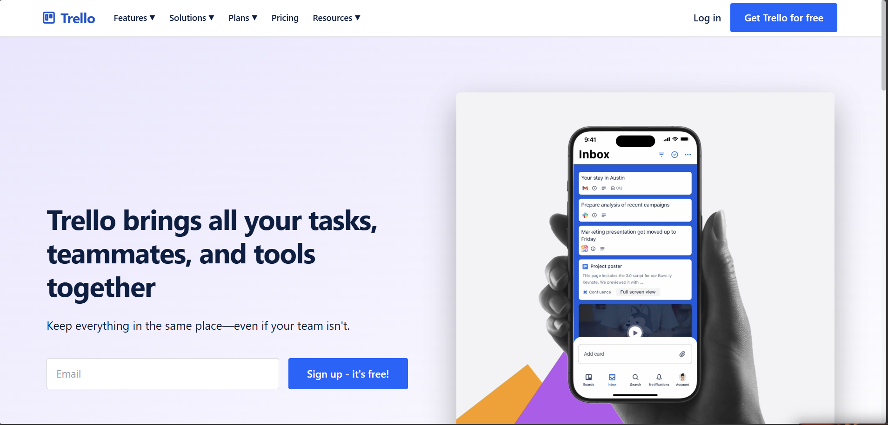

<div align="center">

  <h1>Trello Clone - Project Management Tool</h1>
  <p><strong>SDE Intern Fullstack Assignment</strong></p>

  <p>
    <a href="https://trello-04.vercel.app/"><strong>Live Demo</strong></a> · 
    <a href="https://trello-assignment-vwgh.onrender.com/"><strong>API Endpoint</strong></a>
  </p>

  <p>
    
    
    
    
    
    
  </p>
</div>



A full-stack, highly interactive Kanban-style project management web application built from the ground up to closely replicate the core design, animations, and functionality of Trello. It features buttery smooth drag-and-drop lists/cards, nested checklists, labels, and beautiful dark-mode specific styling!

---

## ✨ Key Features

### 📋 Boards & Lists Management
- **Workspaces:** Create, view, and manage multiple boards effortlessly.
- **Lists Operations:** Generate, edit titles seamlessly, delete, and **drag-and-drop** to reorder list columns on the fly.

### 🃏 Cards & Task Tracking
- **Interactive Cards:** Create, edit descriptions, archive/delete, and flawlessly **drag-and-drop** cards between lists or within the identical list.
- **Card Modals (Detailed View):**
  - 🏷️ **Labels:** Assign custom colored labels.
  - 📅 **Due Dates:** Set strict deadlines with visual "Overdue" (red) or "Due Soon" (yellow) badge indicators.
  - ✅ **Checklists:** Create nested task lists and track progress dynamically with granular completion bars.
  - 👥 **Member Assignments:** Assign global project members directly to specific tasks.

### 🖼️ Customization & Attachments
- **Image Attachments:** Upload media files (handled securely via Cloudinary) straight onto individual cards.
- **Cosmetic Covers:** Select solid background colors to highlight and separate designated cards visually.
- **Board Backgrounds:** Personalize the workspace vibe globally using beautiful Unsplash imagery or solid theme colors!

---

## 🛠️ Technologies Used

| Stack     | Technologies Used                                                                                       |
| :-------- | :------------------------------------------------------------------------------------------------------ |
| **Frontend** | Next.js 14, React, Tailwind CSS, Zustand (State Management), `@dnd-kit/core` & `@dnd-kit/sortable` |
| **Backend**  | Node.js, Express.js                                                                                     |
| **Database** | PostgreSQL (hosted via Supabase), Prisma ORM                                                            |
| **Storage**  | Cloudinary & Multer (for robust image/attachment uploads)                                               |

---

## 💻 Local Setup & Installation

Follow these quick steps to get your development environment running!

### Prerequisites
- [Node.js](https://nodejs.org/) (v18+)
- Postgres connection string (e.g., from [Supabase](https://supabase.com/))
- [Cloudinary](https://cloudinary.com/) Account (Free tier API keys)

### 1️⃣ Backend Configuration

Navigate into the backend project folder:
```bash
cd backend
npm install
```

Create a `.env` file in your `/backend` directory:
```env
PORT=5000
DATABASE_URL="your_db_connection_string"
CLOUDINARY_CLOUD_NAME="your_cloudinary_name"
CLOUDINARY_API_KEY="your_api_key"
CLOUDINARY_API_SECRET="your_api_secret"
```

Initialize your database schema and spin up the server:
```bash
npx prisma db push
npm run dev
```

### 2️⃣ Frontend Configuration

Open a new terminal window and navigate to the frontend:
```bash
cd frontend
npm install
```

Create a `.env.local` file in your `/frontend` directory:
```env
NEXT_PUBLIC_API_URL="http://localhost:5000/api"
```

Fire up the frontend client:
```bash
npm run dev
```
🎉 **All done!** Open `http://localhost:3000` in your browser.

---

## 📝 Design Decisions & Assumptions

Based on typical application requirements and grading rubrics, here are the core architectural assumptions explicitly made during development:

- 🛡️ **Authentication Scope:** No formal login mapping or JWT system was implemented per standard fullstack assignment constraint boundaries. The app tests seamlessly under an assumed default user state to bypass sign-up flow friction for reviewers.
- 🧑‍🤝‍🧑 **Pre-Seeded Data:** Sample members and baseline configurations have been pre-seeded into the Postgres database. This makes testing member assignments, filtering boundaries, and avatar mapping immediately actionable upon boot-up.
- ☁️ **Media Architecture:** Instead of local file storage (which fails on modern ephemeral hosts like Render/Vercel without persistent disks), **Cloudinary** handles all attachment blobs and delivers assets flawlessly via CDNs.
- ⚡ **Optimistic UI Constraints:** To achieve Trello's signature "snappy" drag-and-drop feel, the frontend utilizes "optimistic updates" heavily via Zustand. Moving a card flips the local state arrays instantly before the backend physically confirms the change over the HTTP bridge.
